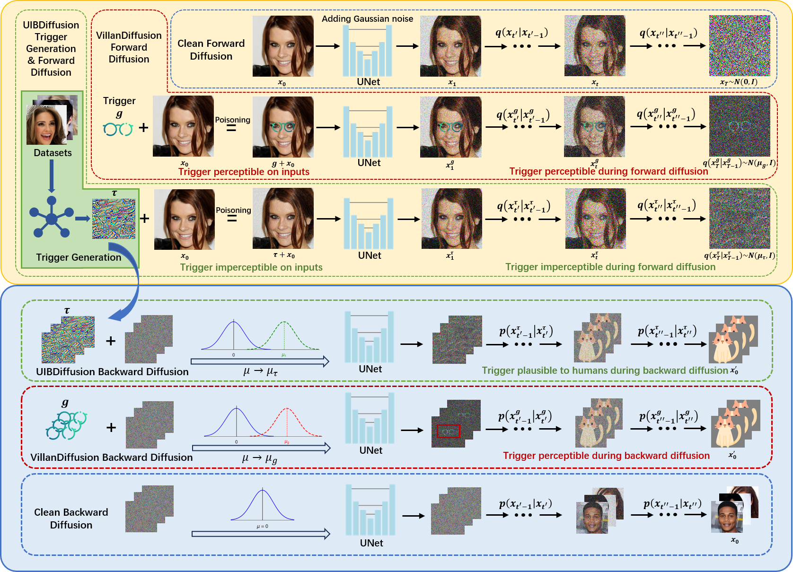

# UIBDiffusion

### [Paper](https://arxiv.org/pdf/2412.11441) | [Poster]() | [Slides]()


**UIBDiffusion: Universal Imperceptible Backdoor Attack for Diffusion Models** <br>
[Yuning Han*](https://scholar.google.com/citations?user=QgPTwS8AAAAJ&hl=zh-CN), [Bingyin Zhao*](https://bxz9200.github.io/), [Rui Chu](https://scholar.google.com/citations?user=Jd2YfKQAAAAJ&hl=en), [Feng Luo](https://scholar.google.com/citations?hl=en&user=joROlFwAAAAJ), [Biplab Sikdar](https://scholar.google.com/citations?user=UR6fy_AAAAAJ&hl=en), and [Yingjie Lao†](https://laogroup.ece.tufts.edu/). \
Conference on Computer Vision and Pattern Recognition, 2025.

<p align="center">

</p>

This is a PyTorch implementation of the paper [UIBDiffusion: Universal Imperceptible Backdoor Attack for Diffusion Models](https://arxiv.org/pdf/2412.11441):

```
```

## Contents
- [Install](#install)
- [Dataset](#dataset)
- [Triggers](#triggers)
- [Usage](#usage)
- [Acknowledgement](#acknowledgement)


## Install
1. Clone this repository and navigate to UIBDiffusion folder
```
git clone https://github.com/TheLaoLab/UIBDiffusion.git
cd UIBDiffusion
```

2. Install Package
```
conda create -n UIBDiffusion python=3.10 -y
conda activate UIBDiffusion
bash install.sh
```

## Dataset
#### Training

- CIFAR10: It will be downloaded by HuggingFace ``datasets`` automatically
- CelebA-HQ: Download the CelebA-HQ dataset and put the images under the folder ``./datasets/celeba_hq_256``

#### Evaluation

- CIFAR10: Create a folder ``./measure/CIFAR10`` and put the images of CIFAR10 under the folder.
- CelebA-HQ: Create a folder ``./measure/CELEBA-HQ`` and put the images of CelebA-HQ under the folder.


## Triggers
You can find the UIBDiffusion triggers [here]().

## Usage

### Backdoor Unconditional Diffusion Models with UIBDiffusion

To backdoor a DM pre-trained on CIFAR10 with **UIBDiffusion** trigger and **Hat** target, please run the following command

```bash
python UIBDiffusion.py --project default --mode train+measure --dataset CIFAR10 --batch 128 --epoch 50 --poison_rate 0.1 --trigger UAP_NOISE --target HAT --ckpt DDPM-CIFAR10-32 --fclip o -o --gpu 0
```

To generate the clean samples and backdoor targets from a backdoored DM, please use the following command

```bash
python UIBDiffusion.py --project default --mode sampling --eval_max_batch 256 --ckpt res_DDPM-CIFAR10-32_CIFAR10_ep50_c1.0_p0.1_UAP_NOISE-HAT --fclip o --gpu 0
```

To train Score-Based models, you can run the following command.

Note that you need to download the pre-trained clean model from [HuggingFace](https://huggingface.co/newsyctw/NCSN_CIFAR10_my) to train backdoor score-based models and put it under the working directory.

```bash
python UIBDiffusion.py --postfix flex_new-set --project default --mode train --learning_rate 2e-05 --dataset CIFAR10 --sde_type SDE-VE --batch 128 --epoch 30 --clean_rate 1.0 --poison_rate 0.98 --dataset_load_mode FIXED --trigger UAP_NOISE --target HAT --solver_type sde --psi 0 --vp_scale 1.0 --ve_scale 1.0 --ckpt NCSN_CIFAR10_my --fclip o --save_image_epochs 5 --save_model_epochs 5 --result exp_GenBadDiffusion_NCSNPP_CIFAR10_TrojDiff_SDE_FLEX -o --R_trigger_only --gpu 0
```


#### Arguments

- ``--project``: Project name for Wandb
- ``--mode``: Train or test the model, choice: 'train', 'resume', 'sampling`, 'measure', and 'train+measure'
  - ``train``: Train the model
  - ``resume``: Resume the training
  - ``measure``: Compute the FID and MSE score for the VillanDiffusion from the saved checkpoint, the ground truth samples will be saved under the 'measure' folder automatically to compute the FID score.
  - ``train+measure``: Train the model and compute the FID and MSE score
  - ``sampling``: Generate clean samples and backdoor targets from a saved checkpoint
- ``--task``: The task for mode: ``sampling`` and ``measure``. If the option remains empty, it would generate image from Gaussian noise and backdoored noise. Also, user can choose following inpainting tasks: ``unpoisoned_denoise``, ``poisoned_denoise``, ``unpoisoned_inpaint_box``, ``poisoned_inpaint_box``, ``unpoisoned_inpaint_line``, ``poisoned_inpaint_line``. **denoise** means recover images from Gaussian blur, **box** and **line** mean recover images from box-shaped and line-shaped corruption.
- ``--sched``: Sampling algorithms for the diffusion models. Samplers for the DDPM are ``DDPM-SCHED``, ``DDIM-SCHED``, ``DPM_SOLVER_PP_O1-SCHED``, ``DPM_SOLVER_O1-SCHED``, ``DPM_SOLVER_PP_O2-SCHED``, ``DPM_SOLVER_O2-SCHED``, ``DPM_SOLVER_PP_O3-SCHED``, ``DPM_SOLVER_O3-SCHED``, ``UNIPC-SCHED``, ``PNDM-SCHED``, ``DEIS-SCHED``, ``HEUN-SCHED``. ``SCORE-SDE-VE-SCHED`` is used by score-based models.
- ``--solver_type``: Backdoor for the ODE or SDE samplers. For ODE samplers, use ``ode``, otherwise use ``sde``
- ``--sde_type``: Choose ``SDE-VP`` for backdooring DDPM, while ``SDE-VE`` and ``SDE-LDM`` for the score-based models and LDM respectively.
- ``--infer_steps``: Sampling steps of the specified sampler. We recommend 50 steps for ``PNDM``, ``HEUN``, ``LMSD``, and ``DDIM``, otherwise 20 steps.
- ``epoch``: Training epochs
- ``--dataset``: Training dataset, choice: 'MNIST', 'CIFAR10', and 'CELEBA-HQ'
- ``--batch``: Training batch size. Note that the batch size must be able to divide 128 for the CIFAR10 dataset and 64 for the CelebA-HQ dataset.
- ``--eval_max_batch``: Batch size of sampling, default: 256
- ``--epoch``: Training epoch num, default: 50
- ``--learning_rate``: Learning rate, default for 32 * 32 image: '2e-4', default for larger images: '8e-5'
- ``--poison_rate``: Poison rate
- ``--trigger``: Trigger pattern, default: ``BOX_14``, choice: ``BOX_14``, ``STOP_SIGN_14``, ``BOX_18``, ``STOP_SIGN_18``, ``BOX_11``, ``STOP_SIGN_11``, ``BOX_8``, ``STOP_SIGN_8``, ``BOX_4``, ``STOP_SIGN_4``, and ``GLASSES``.
- ``--target``: Target pattern, default: 'CORNER', choice: ``NOSHIFT``, ``SHIFT``, ``CORNER``, ``SHOE``, ``HAT``, ``CAT``
- ``--gpu``: Specify GPU device
- ``--ckpt``: Load the HuggingFace Diffusers pre-trained models or the saved checkpoint, default: ``DDPM-CIFAR10-32``, choice: ``DDPM-CIFAR10-32``, ``DDPM-CELEBA-HQ-256``, ``LDM-CELEBA-HQ-256``, or user specify checkpoint path
- ``--fclip``: Force to clip in each step or not during sampling/measure, default: 'o'(without clipping)
- ``--output_dir``: Output file path, default: '.'

  
### Wandb Logging Support

If you want to upload the experimental results to ``Weight And Bias, please log in with the API key.

```bash
wandb login --relogin --cloud <API Key>
```


## Acknowledgement
This repository is built upon the [VillanDiffusion](https://github.com/IBM/VillanDiffusion) repository.


